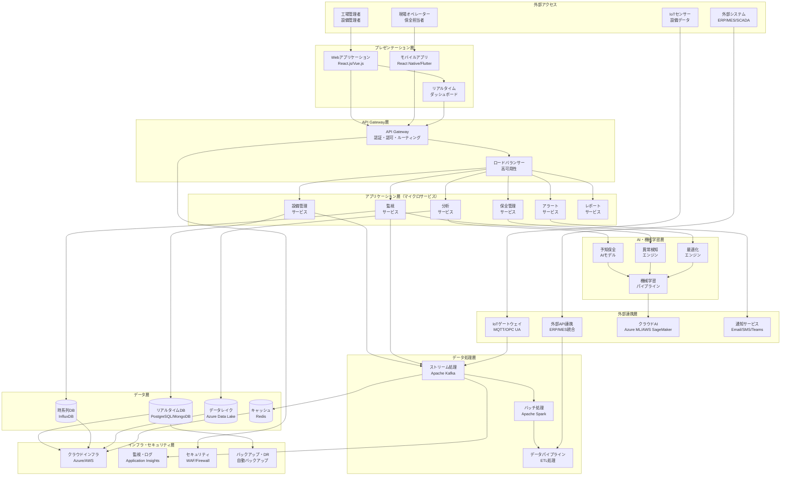
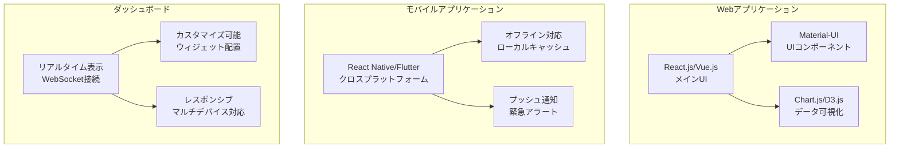
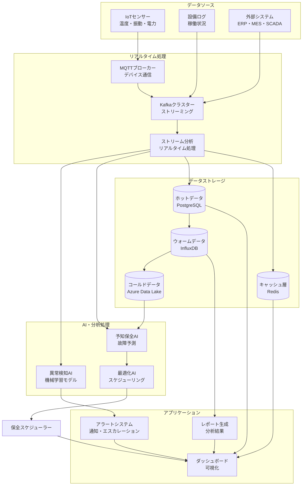
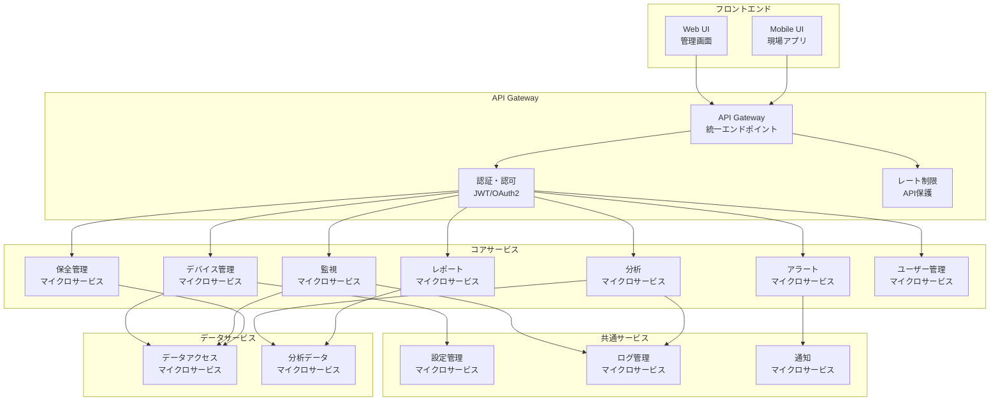
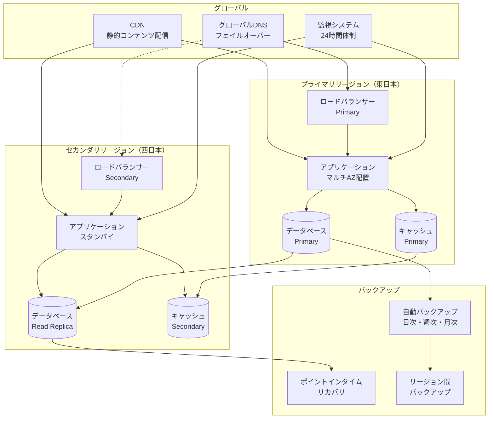
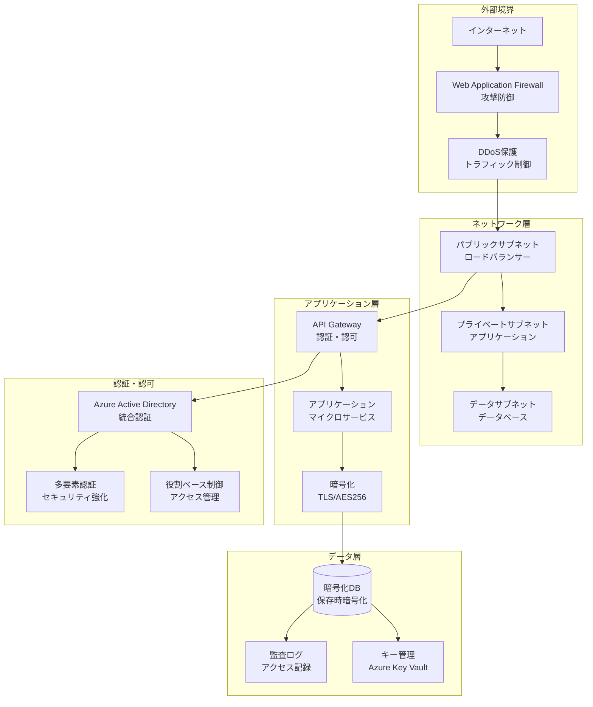
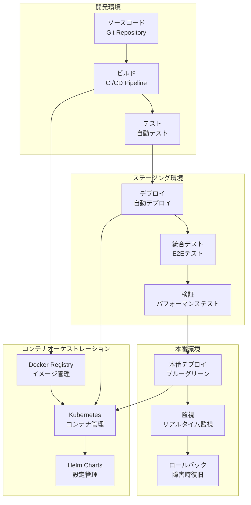

# 工場設備管理システム - アーキテクチャ設計書

## 概要

本文書では、工場設備管理システムの詳細なアーキテクチャ設計について記載します。機能要件、非機能要件、ユースケースに基づいて、スケーラブルで拡張可能なシステムアーキテクチャを提案します。

## システム全体アーキテクチャ

以下のMermaid図は、工場設備管理システムの全体的なアーキテクチャを表現しています。

## 技術アーキテクチャ詳細

### プレゼンテーション層

### データフロー・アーキテクチャ

## マイクロサービス・アーキテクチャ

### サービス分割設計

## 非機能要件への対応

### 高可用性・災害復旧

## セキュリティ・アーキテクチャ

## デプロイメント・アーキテクチャ

## まとめ

本アーキテクチャ設計は以下の特徴を持ちます：

### 設計原則
1. **マイクロサービス・アーキテクチャ**: スケーラビリティと保守性を重視
2. **イベント駆動型設計**: リアルタイム処理に最適化
3. **クラウドネイティブ**: 高可用性と災害復旧を考慮
4. **セキュリティ・ファースト**: 多層防御によるセキュリティ確保

### 技術的特徴
- **IoT・AI統合**: センサーデータとAI分析のシームレス連携
- **リアルタイム処理**: ストリーミング処理による低遅延実現
- **拡張性**: 水平スケールアウト対応
- **運用性**: 自動監視・自動復旧機能

### ビジネス価値
- **稼働率向上**: 予知保全による計画的メンテナンス
- **コスト削減**: 効率的なリソース活用
- **安全性向上**: 異常の早期検知・対応
- **意思決定支援**: データドリブンな経営判断

このアーキテクチャにより、工場設備管理システムの要求事項を満たし、将来の拡張にも対応可能な堅牢なシステムを実現できます。