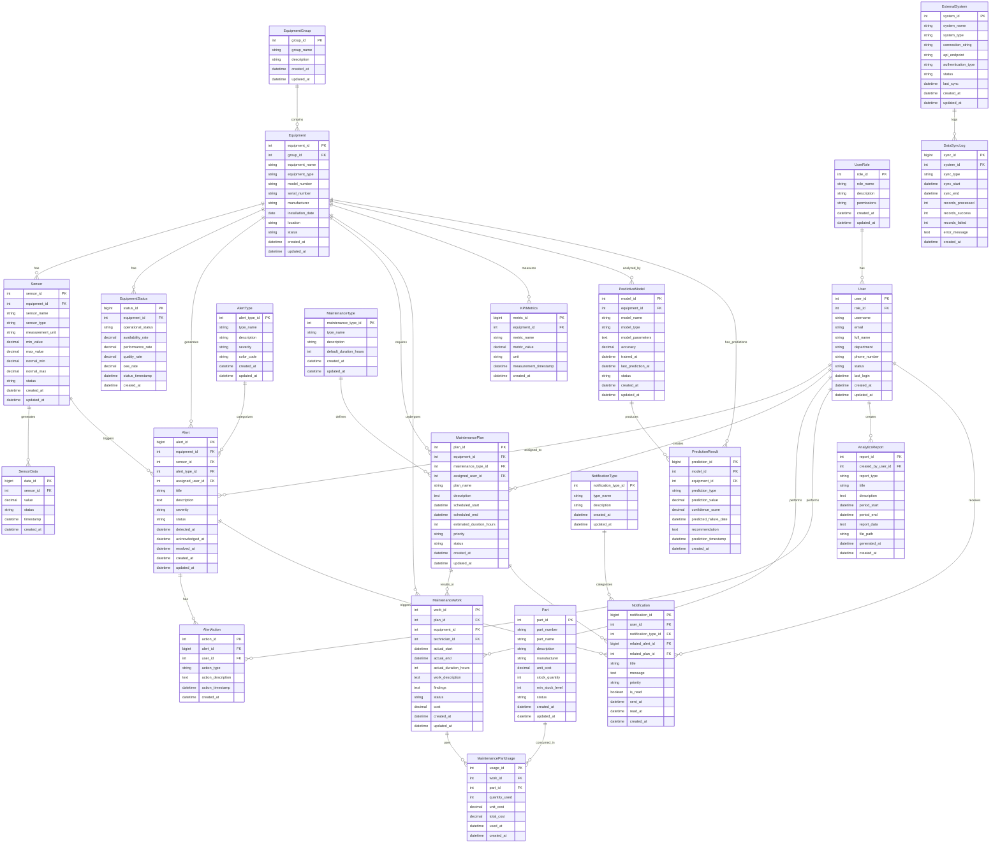

# 工場設備管理システム - データモデル設計書

## 概要

本ドキュメントでは、工場設備管理システムのユースケース仕様書と機能要件定義書に基づいて設計されたデータモデルを定義します。このデータモデルは、IoT技術とAIを活用した工場設備の効率的な監視、予知保全、データ分析機能を実現するために必要な全てのデータ要素を網羅しています。

## データモデル構成

### エンティティ関係図（Mermaid記法）

## エンティティ詳細説明

### 1. 設備関連エンティティ

#### EquipmentGroup（設備グループ）
工場内の設備を論理的にグループ化するためのエンティティです。製造ライン、部門、設備タイプなどで分類します。

#### Equipment（設備）
工場内の個々の設備・機械を表現します。設備の基本情報、設置場所、稼働状況を管理します。

#### Sensor（センサー）
各設備に設置されたIoTセンサーの情報を管理します。センサータイプ、測定範囲、正常値範囲を定義します。

#### SensorData（センサーデータ）
センサーから収集されるリアルタイムデータを格納します。大容量データに対応するため、適切なパーティショニング戦略が必要です。

#### EquipmentStatus（設備状態）
設備の稼働状況、可用性、性能、品質を総合したOEE（Overall Equipment Effectiveness）指標を管理します。

### 2. ユーザー関連エンティティ

#### UserRole（ユーザー役割）
システム利用者の役割を定義し、権限管理を行います。設備管理者、保全担当者、製造オペレーターなどの役割を管理します。

#### User（ユーザー）
システム利用者の基本情報と認証情報を管理します。

### 3. アラート関連エンティティ

#### AlertType（アラート種別）
アラートの分類と重要度を定義します。故障予兆、異常値、保全期限などの種別を管理します。

#### Alert（アラート）
設備異常や故障予兆の検知結果を管理します。検知時刻、対応状況、解決時刻を追跡します。

#### AlertAction（アラート対応）
アラートに対する対応履歴を記録します。対応者、対応内容、対応時刻を管理します。

### 4. 保全関連エンティティ

#### MaintenanceType（保全種別）
予防保全、予知保全、事後保全などの保全作業の種別を定義します。

#### MaintenancePlan（保全計画）
設備の保全スケジュールを管理します。予知保全の結果に基づく計画や定期保全計画を含みます。

#### MaintenanceWork（保全作業）
実際に実施された保全作業の記録を管理します。作業時間、コスト、結果を追跡します。

#### Part（部品）
保全作業で使用する部品の在庫情報を管理します。

#### MaintenancePartUsage（保全部品使用）
保全作業で使用された部品の使用履歴を記録します。

### 5. 分析・レポート関連エンティティ

#### AnalyticsReport（分析レポート）
システムで生成される各種分析レポートの情報を管理します。

#### KPIMetrics（KPI指標）
設備パフォーマンスの重要業績評価指標を時系列で管理します。

### 6. 通知関連エンティティ

#### NotificationType（通知種別）
システムから送信される通知の種別を定義します。

#### Notification（通知）
ユーザーへの通知履歴を管理します。アラート通知、保全リマインダー、レポート配信などを含みます。

### 7. AI/ML関連エンティティ

#### PredictiveModel（予測モデル）
設備ごとのAI予測モデルの情報を管理します。モデルの精度、学習日時、状態を追跡します。

#### PredictionResult（予測結果）
AI予測モデルによる故障予測結果を管理します。予測値、信頼度、推奨アクションを記録します。

### 8. 外部システム連携エンティティ

#### ExternalSystem（外部システム）
ERP、MES、SCADAなどの外部システムとの連携情報を管理します。

#### DataSyncLog（データ同期ログ）
外部システムとのデータ同期履歴を記録し、連携状況を監視します。

## データモデル設計の考慮事項

### 1. スケーラビリティ
- センサーデータは大量のデータが生成されるため、時系列データベースの活用を検討
- 履歴データのアーカイブ戦略を定義
- 水平スケーリングに対応したパーティショニング設計

### 2. パフォーマンス
- リアルタイム監視に必要なレスポンス性能を確保
- 分析処理用のデータマートの構築
- 適切なインデックス設計

### 3. データ品質
- センサーデータの欠損値や異常値の処理
- データ整合性制約の定義
- データ入力時のバリデーション

### 4. セキュリティ
- 個人情報の適切な管理
- アクセス制御の実装
- データ暗号化の適用

### 5. 可用性
- データバックアップとリストア戦略
- 災害時の事業継続性確保
- システム冗長化の考慮

## ユースケース対応表

### UC-001: リアルタイム設備監視
- **関連エンティティ**: Equipment, Sensor, SensorData, EquipmentStatus, Alert
- **データフロー**: センサーデータ収集 → 異常検知 → アラート生成 → 通知送信

### UC-002: 予知保全の実施
- **関連エンティティ**: PredictiveModel, PredictionResult, MaintenancePlan, Alert
- **データフロー**: センサーデータ分析 → AI予測 → 保全計画生成 → 通知送信

### UC-003: 設備稼働データの分析
- **関連エンティティ**: SensorData, EquipmentStatus, KPIMetrics, AnalyticsReport
- **データフロー**: 履歴データ抽出 → 分析実行 → レポート生成 → 結果保存

### UC-004: アラート管理と対応
- **関連エンティティ**: Alert, AlertAction, User, Notification
- **データフロー**: アラート検知 → 担当者通知 → 対応実施 → 履歴記録

### UC-005: 設備パフォーマンス可視化
- **関連エンティティ**: Equipment, SensorData, EquipmentStatus, KPIMetrics
- **データフロー**: リアルタイムデータ取得 → 指標計算 → ダッシュボード表示

### UC-006: 保全計画の策定と管理
- **関連エンティティ**: MaintenancePlan, MaintenanceWork, User, Part
- **データフロー**: 予測結果分析 → 計画生成 → リソース調整 → スケジュール登録

### UC-007: データ分析レポートの生成
- **関連エンティティ**: AnalyticsReport, KPIMetrics, SensorData, User
- **データフロー**: データ抽出 → 分析実行 → レポート生成 → 自動配信

## まとめ

本データモデルは、工場設備管理システムの全ユースケースを網羅し、IoT技術とAIを活用した効率的な設備管理を実現するための包括的なデータ構造を提供します。リアルタイムデータ処理、予知保全、分析レポート生成などの機能要件を満たすとともに、将来の機能拡張にも対応できる柔軟性を備えています。

実装時には、データ量、パフォーマンス要件、セキュリティ要件を考慮して、適切なデータベース技術とアーキテクチャを選択することが重要です。