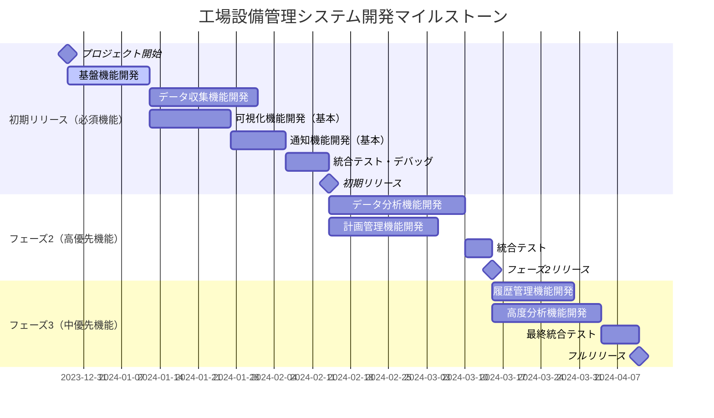

# 工場設備管理システム - プロジェクトマイルストーン

## 概要

本ドキュメントでは、工場設備管理システムの開発プロジェクトにおけるマイルストーンを詳細に定義します。リソース状況とユースケースを基に、優先順位を考慮した段階的な開発計画を策定しています。

## リソース状況と稼働日数計算

### プロジェクト基本情報
- **案件開始日**: 2023年12月28日
- **初期リリース予定日**: 2024年3月28日（3か月後）
- **開発者数**: 3名
- **平均稼働率**: 90%
- **稼働日**: 土日・祝日を除く営業日のみ

### 稼働日数計算の過程

#### 期間計算（2023/12/28 ～ 2024/3/28）
- **総日数**: 92日
- **土日**: 約26日
- **祝日**: 約6日（正月3日間、建国記念日、春分の日等）
- **営業日**: 92 - 26 - 6 = **60営業日**

#### 総工数計算
- **理論工数**: 3名 × 60営業日 × 8時間 = 1,440時間
- **実稼働工数**: 1,440時間 × 90% = **1,296時間**

#### 機能別工数見積もり（人日換算）
- **基盤機能（インフラ・認証等）**: 15人日
- **データ収集機能**: 25人日
- **可視化機能（基本ダッシュボード）**: 20人日
- **通知機能（基本アラート）**: 15人日
- **データ分析機能（基本異常検知）**: 30人日
- **計画管理機能（基本スケジューリング）**: 25人日
- **履歴管理機能**: 20人日
- **テスト・デバッグ**: 12人日
- **合計**: 162人日

#### 稼働率考慮後の所要工数
- **実質必要工数**: 162人日 ÷ 90% = 180人日
- **利用可能工数**: 3名 × 60営業日 = 180人日
- **工数バランス**: ほぼ100%の稼働率でリリース可能

## 機能優先順位付け

### 最優先（初期リリース必須機能）
1. **基盤機能** - システムの土台として必須
2. **データ収集機能** - IoTセンサーからのデータ収集（コア機能）
3. **可視化機能（基本）** - リアルタイムダッシュボード
4. **通知機能（基本）** - 緊急アラート機能

### 高優先（初期リリース後1か月以内）
5. **データ分析機能（基本）** - 異常検知とトレンド分析
6. **計画管理機能（基本）** - 保全スケジューリング

### 中優先（リリース後2-3か月以内）
7. **履歴管理機能** - データアーカイブと履歴分析
8. **高度な分析機能** - 予知保全とAI分析

## マイルストーン計画

## 各マイルストーンの詳細

### マイルストーン1: 初期リリース（2024年3月28日）

#### 実装機能
- **基盤機能**: 認証、ユーザー管理、基本設定
- **データ収集機能**: IoTセンサーからのリアルタイムデータ収集
- **可視化機能**: 基本ダッシュボード、設備状況表示
- **通知機能**: 基本アラート、緊急通知

#### 提供価値
- リアルタイム設備監視の実現
- 異常検知による迅速な対応
- 24時間監視体制の確立

#### 成功基準
- IoTセンサーからのデータ収集率 > 95%
- アラート応答時間 < 30秒
- システム稼働率 > 99%

### マイルストーン2: フェーズ2リリース（2024年5月中旬）

#### 実装機能
- **データ分析機能**: 異常検知、トレンド分析
- **計画管理機能**: 保全スケジューリング、リソース管理

#### 提供価値
- 予知保全の基盤構築
- 効率的な保全計画策定
- データドリブンな意思決定支援

#### 成功基準
- 異常検知精度 > 85%
- 保全計画の最適化による稼働率向上 > 10%

### マイルストーン3: フルリリース（2024年7月末）

#### 実装機能
- **履歴管理機能**: データアーカイブ、履歴分析
- **高度分析機能**: AI予知保全、最適化エンジン

#### 提供価値
- 長期的な設備管理戦略の支援
- AI活用による高精度故障予測
- 総合的な設備パフォーマンス最適化

#### 成功基準
- 故障予測精度 > 90%
- 保全コスト削減 > 15%
- 設備稼働率向上 > 38%

## リスク管理

### 主要リスクと対策

#### 技術的リスク
- **IoT接続の不安定性**
  - 対策: 冗長化、オフライン機能の実装
  - バッファ期間: 5日

- **大量データ処理の性能問題**
  - 対策: スケーラブルアーキテクチャの採用
  - バッファ期間: 7日

#### スケジュールリスク
- **要件変更**
  - 対策: アジャイル開発手法の採用
  - バッファ期間: 10日（総工数の5%）

- **人的リソース不足**
  - 対策: 外部リソースの確保、優先機能の絞り込み
  - 代替案: フェーズ2の一部機能を初期リリース後に延期

## まとめ

本マイルストーン計画により、限られたリソースの中で最大の価値を提供する段階的な開発が可能になります。初期リリースでは基本的な監視・通知機能を確実に提供し、その後段階的に高度な分析・予知保全機能を追加することで、ユーザーの業務価値を継続的に向上させていきます。