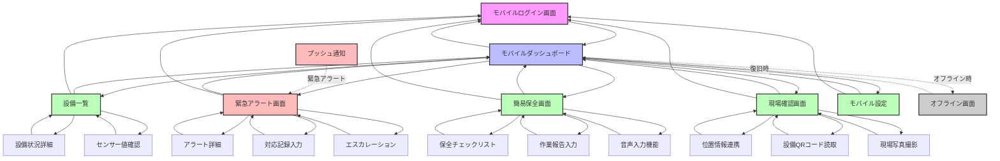
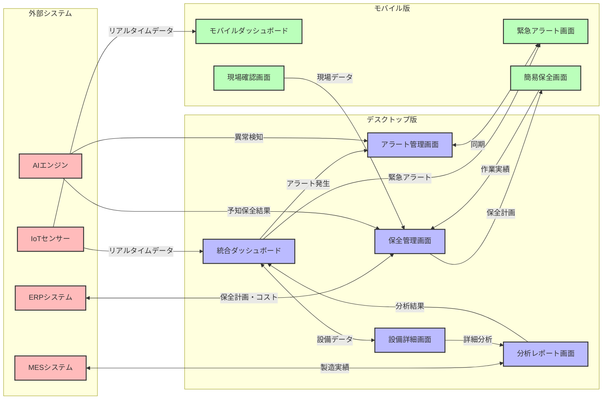

# 工場設備管理システム - 画面遷移図

## 概要

本文書は、工場設備管理システムのユーザーインターフェース画面遷移図をMermaid記法で定義します。機能要件定義書とユースケース仕様書に基づいて、主要な画面とその遷移パターンを体系的に整理しています。

## 主要画面構成

### 1. デスクトップ版画面構成
- **ログイン画面**: システムへの認証エントリーポイント
- **統合ダッシュボード**: 設備全体の状況監視とKPI表示
- **設備詳細画面**: 個別設備の詳細データとセンサー情報
- **アラート管理画面**: アラートの確認、対応、履歴管理
- **保全管理画面**: 予知保全計画とスケジュール管理
- **分析レポート画面**: データ分析とレポート生成
- **設定画面**: ユーザー設定とシステム設定

### 2. モバイル版画面構成
- **モバイルログイン画面**: モバイル最適化された認証画面
- **モバイルダッシュボード**: 簡略化されたダッシュボード
- **緊急アラート画面**: アラート専用のモバイル画面
- **現場確認画面**: 位置情報連携の設備確認画面

## 画面遷移図

### デスクトップ版メイン画面遷移

```mermaid
flowchart TD
    A[ログイン画面] --> B[統合ダッシュボード]
    
    B --> C[設備詳細画面]
    B --> D[アラート管理画面]
    B --> E[保全管理画面]
    B --> F[分析レポート画面]
    B --> G[設定画面]
    
    C --> C1[設備概要タブ]
    C --> C2[センサーデータタブ]
    C --> C3[履歴タブ]
    C --> C4[保全タブ]
    
    D --> D1[アクティブアラート]
    D --> D2[アラート履歴]
    D --> D3[アラート設定]
    
    E --> E1[予知保全計画]
    E --> E2[定期保全スケジュール]
    E --> E3[保全実施記録]
    E --> E4[保全リソース管理]
    
    F --> F1[稼働率分析]
    F --> F2[故障率分析]
    F --> F3[品質相関分析]
    F --> F4[カスタムレポート]
    
    G --> G1[ユーザー設定]
    G --> G2[通知設定]
    G --> G3[ダッシュボード設定]
    G --> G4[システム管理]
    
    %% 戻り遷移
    C --> B
    D --> B
    E --> B
    F --> B
    G --> B
    
    C1 --> C
    C2 --> C
    C3 --> C
    C4 --> C
    
    D1 --> D
    D2 --> D
    D3 --> D
    
    E1 --> E
    E2 --> E
    E3 --> E
    E4 --> E
    
    F1 --> F
    F2 --> F
    F3 --> F
    F4 --> F
    
    G1 --> G
    G2 --> G
    G3 --> G
    G4 --> G
    
    %% 緊急アラート遷移
    B -.->|緊急アラート| D
    C -.->|緊急アラート| D
    E -.->|緊急アラート| D
    F -.->|緊急アラート| D
    
    %% ログアウト
    B --> A
    C --> A
    D --> A
    E --> A
    F --> A
    G --> A
    
    classDef loginClass fill:#f9f,stroke:#333,stroke-width:2px
    classDef mainClass fill:#bbf,stroke:#333,stroke-width:2px
    classDef subClass fill:#bfb,stroke:#333,stroke-width:2px
    classDef alertClass fill:#fbb,stroke:#333,stroke-width:2px
    
    class A loginClass
    class B mainClass
    class C,E,F,G subClass
    class D alertClass
```

### モバイル版画面遷移

### 画面間連携とデータフロー

## 画面遷移パターンの詳細

### 1. 通常業務フロー
1. **ログイン** → **統合ダッシュボード** → **各機能画面**
2. ダッシュボードから必要な機能にアクセス
3. 作業完了後はダッシュボードに戻る

### 2. 緊急対応フロー
1. **アラート発生** → **自動画面遷移** → **アラート管理画面**
2. モバイルの場合：**プッシュ通知** → **緊急アラート画面**
3. 対応完了後は元の画面に戻る

### 3. 現場作業フロー（モバイル）
1. **プッシュ通知** → **現場確認画面**
2. **位置情報連携** → **QRコード読取** → **作業記録**
3. **音声入力** → **写真撮影** → **報告送信**

### 4. 分析・レポートフロー
1. **ダッシュボード** → **分析レポート画面**
2. **期間選択** → **分析実行** → **結果表示**
3. **レポート生成** → **配信** → **アーカイブ**

## モバイル対応の特徴

### レスポンシブデザイン
- **デスクトップ**: フル機能のダッシュボード表示
- **タブレット**: 主要機能に特化した表示
- **スマートフォン**: アラート確認と簡易操作に最適化

### モバイル専用機能
- **プッシュ通知**: 緊急アラートの即座通知
- **位置情報連携**: 現場との設備確認
- **音声入力**: 作業報告の音声入力
- **オフライン対応**: ネットワーク断絶時の基本機能継続

### 操作性配慮
- **大きなボタン**: 工場環境での操作性を考慮
- **シンプルナビゲーション**: 直感的な画面遷移
- **音声フィードバック**: 騒音環境での操作確認

## セキュリティと権限管理

### アクセス制御
- 各画面へのアクセス権限は役割ベース（RBAC）で管理
- 機密度の高い設定画面は管理者権限が必要
- モバイルアクセスは追加認証が必要

### データ保護
- 画面間のデータ送信は暗号化
- セッション管理による不正アクセス防止
- 監査ログによる画面アクセス履歴記録

## まとめ

本画面遷移図は、工場設備管理システムの効率的な操作フローを実現するために設計されています。デスクトップとモバイルの両方に対応し、緊急時の迅速な対応と日常的な監視業務の両方をサポートします。

ユーザーの役割に応じた適切な画面アクセスと、直感的な操作性を重視した設計により、工場の生産性向上と安全性確保に貢献します。